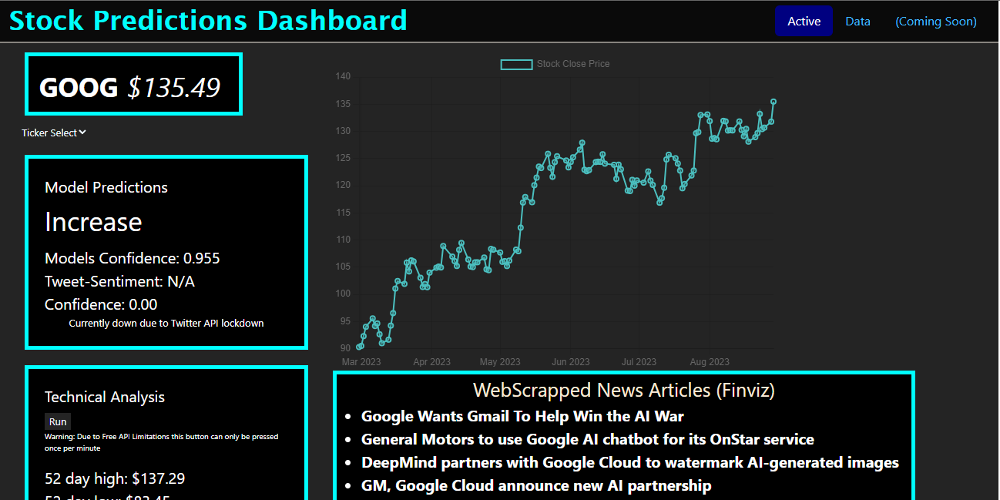
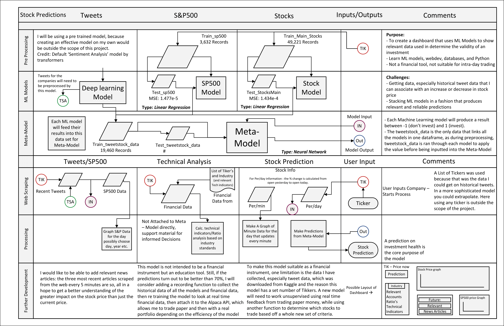

# Stock Price Prediction Web App

## Introduction

This project aimed at creating machine learning models to predict whether the stock price for a given company would increase or decrease on a particular day. It is built on two random forest models and provides an interactive interface via a Flask web application for users to explore the predictions alongside valuable financial data.

## Features

- **Stock Price Prediction**: Predictions on whether the stock price will increase or decrease.
- **Stock Selection**: Option to choose from one of 17 stock tickers that the models were trained on.
- **Stock Historical Data**: Graphs and displays stock information from the past 6 months using the Yahoo Finance API.
- **News Feed**: Scraped news articles related to the selected stock from the Finviz website.
- **Financial Information Display**: Retrieves and displays financial data of the selected company from the Alpha Vantage API, including ratio and technical analyses.

*This Flow Chart captures the flow of information including what the project would have looked liked with the inclusion of Tweet Data*

## Ratio/Technical Analysis
- Calculated from the Alpha Vantage API
### Earnings
- 52 Day high / 52 day low
- Diluted Earnings Per Share
- YOY Quarterly Rev Growth
- AlphaVantage Target Price (Used to compare against my own model's conclusions
### Profitability
- **Gross Margin**:
- **Return on Asset**:
- **Return on Equity**:
### Liquidity
- **Current Ratio**:
- **Acid Test**:
### Solvency
- **Debt to Equity**:
- **Debt Ratio**:

## Installation/Setup

Installation and Setup are simple, as one only needs to download all of the relevant code and run the app.py file, after adding the necessary packages, which a list of can be found below. The one issue that might arise when trying to download the necessary files is the two machine learning models, which are quite large currently, but I am in the testing phase trying to decrease the file size without harming the model's accuracy. 

## Usage

1. Navigate to the Flask web application (Currently only Locally Hosted).
2. From the dropdown, select one of the 17 stock tickers.
3. The application will display the prediction for the day.
4. View the comprehensive financial data, 6-month stock history graph, and related news articles for informed decision-making.

## Technologies/APIs Used

- **Machine Learning**: Random Forest models.
- **Web Framework**: Flask.
- **APIs**: 
  - Alpha Vantage for financial information.
  - Yahoo Finance for historical stock data.
- **Web Scraping**: Finviz for news articles.

## Packages Used
### Main Packages
- **Pandas**: Data manipulation
- **datetime**: Time calculations
- **dotenv**: For use in an application to keep passwords and API keys secure
- **Flask**: Blueprint, render_template, request, flash, redirect, url_for, session, jsonify
- **os**: Used for env variables
### Financial data
- **Requests**: Webscraping
- **BeautifulSoup**: HTML Parsing
### Machine Learning
- **Pickle**: Load Serialized ML models
### Unused for Twitter
- **twscrape**: Special Thanks to the creator of twscrape, with a very clever way of working around the twitter API before that stopped working too.
- **trasnformers**: I wanted to use a hugging face transformer to run the sentiment analysis

## Warnings/Disclaimers

1. **Twitter API Limitation**: Initially, this project was designed to incorporate tweets into the machine learning models and the web application. However, due to the termination of free services on the Twitter API, this feature is unavailable.
2. **Educational Purpose Only**: This project was designed and developed as a learning experience. The predictions and data provided should **not** be used for actual financial decision-making.
